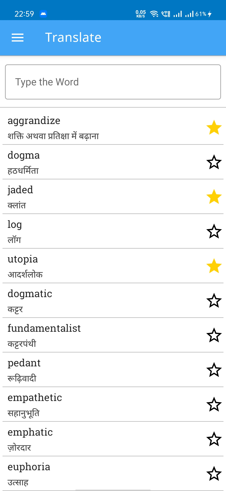
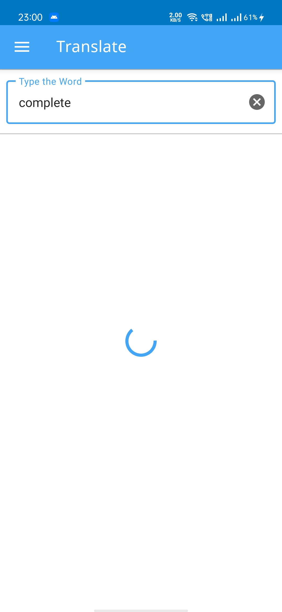
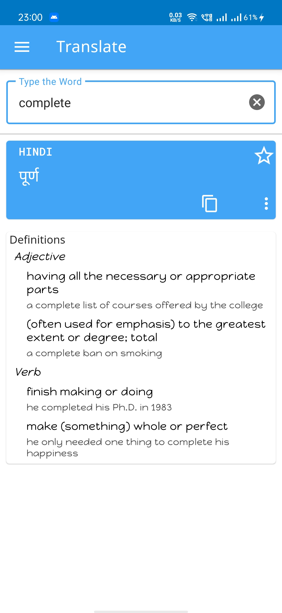
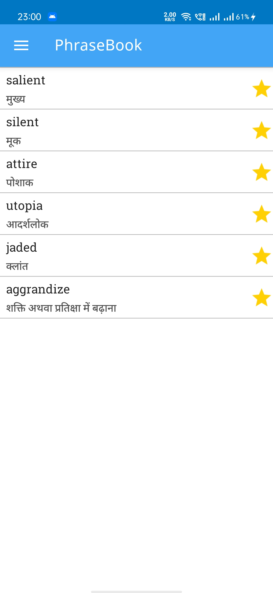
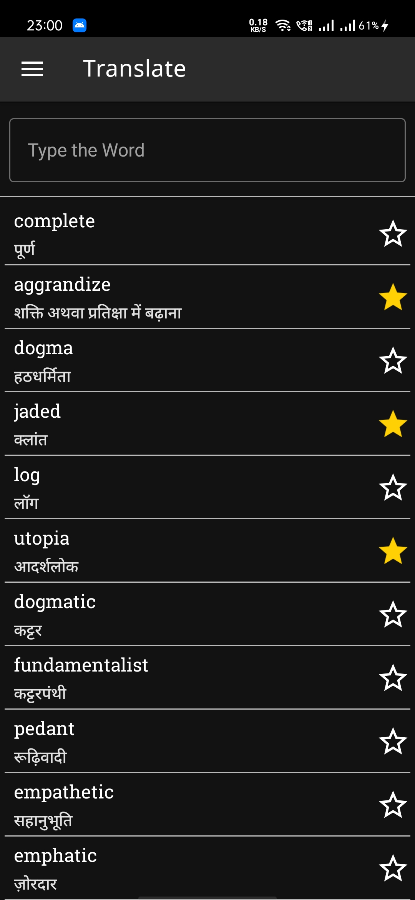
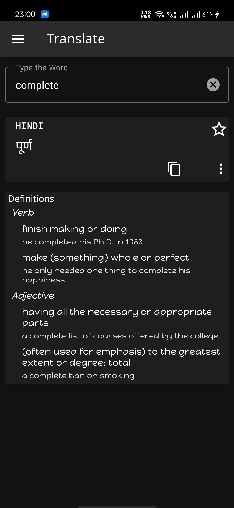
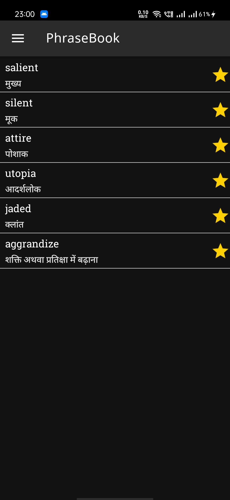

# Translator

A minimalistic translation app that translates words or sentences from English to Hindi, built using *MVVM architecture with latest Android Development tools*.

## Designs - Dark Mode also available 🌙
    
  

## Built with
- [Kotlin](https://kotlinlang.org/) - First class and official programming language for Android development.
- [Coroutines](https://kotlinlang.org/docs/reference/coroutines-overview.html) - For asynchronous and more..
- [Android Architecture Components](https://developer.android.com/topic/libraries/architecture) - Collection of libraries that help you design robust, testable, and maintainable apps.
  - [LiveData](https://developer.android.com/topic/libraries/architecture/livedata) - Data objects that notify views when the underlying database changes.
  - [ViewModel](https://developer.android.com/topic/libraries/architecture/viewmodel) - Stores UI-related data that isn't destroyed on UI changes. 
  - [DataBinding](https://developer.android.com/topic/libraries/data-binding?authuser=1) - Generates a binding class for each XML layout file present in that module and allows you to write powerful binding expressions for binding data directly to layouts.
  - [Room](https://developer.android.com/topic/libraries/architecture/room) - SQLite object mapping library.
- [Hilt](https://dagger.dev/hilt/) - Dependency Injection Framework
- [Retrofit](https://square.github.io/retrofit/) - A type-safe HTTP client for Android and Java.
- [Moshi](https://github.com/square/moshi) - A modern JSON library for Kotlin and Java.
- [Moshi Converter](https://github.com/square/retrofit/tree/master/retrofit-converters/moshi) - A Converter which uses Moshi for serialization to and from JSON.
- [Glide](https://bumptech.github.io/glide/) - An image loading library for Android backed by Kotlin Coroutines.
- [Material Components for Android](https://github.com/material-components/material-components-android) - Modular and customizable Material Design UI components for Android.
- [MaterialColors](https://github.com/theapache64/material_colors) - Android material color palettes

 

## Architecture 🗼

This project follows the famous MVVM architecture and best practices from Google's [GithubBrowserSample](https://github.com/android/architecture-components-samples/tree/master/GithubBrowserSample)

## Backend
This app gets the translations from the backend hosted at heroku. Built using *Python and Flask*.

## Credits 🤗

- 🤓 Icons are from [flaticon.com](https://www.flaticon.com/) 
- 💽 Data from [translator api](https://translator-api.herokuapp.com/translate/{word or sentence})
